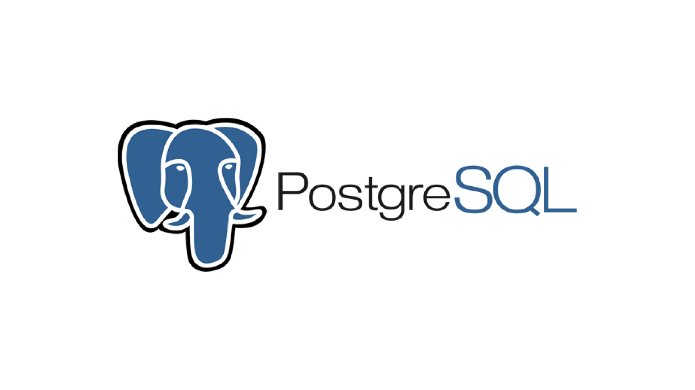
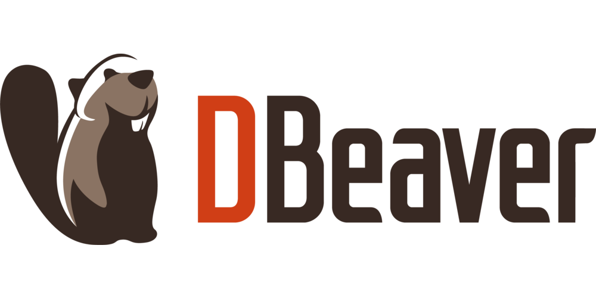

# Лабораторная работа №1

## Подготовка

Описанные ниже инструкции приведены для `Fedora 43`.

### Установка PostgreSQL Fedora

- [Ссылка на официальную страницу скачивания](https://www.postgresql.org/download/)
- [Ссылка на гайд по установке для Red Hat Family](https://www.postgresql.org/download/linux/redhat/)

Добавляем официальный репозиторий PostgreSQL:

```bash
sudo dnf install -y https://download.postgresql.org/pub/repos/yum/reporpms/F-44-x86_64/pgdg-fedora-repo-latest.noarch.rpm
```

Устанавливаем сервер PostgreSQL

```bash
sudo dnf install -y postgresql18-server
```

Инициализируем кластер базы данных:

```bash
sudo /usr/pgsql-18/bin/postgresql-18-setup initdb
```

Проверяем, что все в порядке:

```cpp
arist0crab@fedora:~$ sudo systemctl status postgresql-18
[sudo] password for arist0crab: 
○ postgresql-18.service - PostgreSQL 18 database server
     Loaded: loaded (/usr/lib/systemd/system/postgresql-18.service; disabled; preset: disabled)
    Drop-In: /usr/lib/systemd/system/service.d
             └─10-timeout-abort.conf
     Active: inactive (dead)
       Docs: https://www.postgresql.org/docs/18/static/
```

### Установка DBeaver Fedora

Сразу скажу, что если скачивать с официального сайта `rpm` пакет и устанавливать его вкучную, то скорее всего вы столкнетесь с тем, что ваша `java` версия не нравится бобру, или он считает, что у вас нет самой `java`. Чтобы не забираться в тонкости подкачки 17-й версии `java`, т.к. судя по всему грызуну нужна именно она, можно скачивать с `flatpak`, тогда системная `java` вообще не нужна будет.

Устанавливаем `Flatpak`:

```bash
sudo dnf install flatpak
```

Добавляем репозиторий `flathub`:

```sh
flatpak remote-add --if-not-exists flathub https://flathub.org/repo/flathub.flatpakrepo
```

Устанавливаем `DBeaver`:

```bash
flatpak install flathub io.dbeaver.DBeaverCommunity
```

После этого `DBeaver` должен появиться в меню приложений.

## Что это было

### PostgreSQL



Начнем с того, что такое `PostgreSQL`.

> [!IMPORTANT] PostgreSQL
> Это бесплатная open-source реляционная СУБД использующая SQL

В контексте наших лабораторных работ нам важно то, что она будет хранить все данные на диске и добавлять, удалять, изменять их по нашим запросам.

Подробнее про архитектуру системы `PostgreSQL` можно прочитать [тут](https://postgrespro.ru/docs/postgresql/18/tutorial-arch). Там буквально полтора абзаца, настоятельно рекомендую. Но говоря короче это серверное приложение: оно работает в фоновом режиме и ждёт подключений от клиентов (вашего приложения, pgAdmin, командной строки и тд).

Поскольку это сервер, он управляется как системная служба, то есть его необходимо включать и выключать.

Перед тем, как мы сможем что-либо сделать в нашем базе данных нам необходимо создать пространство, где будет храниться БД. Такое пространтсво носит название **кластера**.

> [!IMPORTANT] Кластер
> Это коллекция баз данных, которые управляются единственным экземпляром запущенного сервера. Нет, это не нейрослоп. Это попытка перевести определение с [английского](https://docs.postgresql.tw/server-administration/runtime/creating-cluster).

Сам серверный процесс (postgres) при запуске привязывается к одному такому кластеру. Поэтому один запущенный экземпляр PostgreSQL может управлять только данными из одного кластера.

Если рассматривать кластер с точки зрения файловой системы, то кластер - это одинокая директория в которой будут храниться все наши данные. 

По сути кластер можно рассматривать как некоторое виртуальное пространство со своими настройками памяти, правилами доступа, параметрами сети, логами и журналами, выделяемое для какой-либо конретной цели. Нам для цели "закрыть курс по БД" хватит одного кластера. Но если завтра вы захотите поднимать свое приложение с БД, вероятно есть смысл создать отдельный кластер для этих целей.

### DBeaver



Совершим горизонтальное движение по миру животных и перейдем он слонов к бобрам. 

> [!IMPORTANT] DBeaver
> Это бесплатный open-source графический инструмент для работы с базами данных. 

По сути ДБобер нужен только для удобного представления структуры базы данных в человекочитаемом формате, так как (как выяснилось абзацем выше) PostgreSQL - это просто голая СУБД в клиент-серверном формате, и никаких красивых табличек она нам не предлагает.

Документацию на `github` по де бобрам можно найти [здесь](https://github.com/dbeaver/dbeaver/wiki).

## Полезная шляпа

Реально полезная, без шуток.

- [Фулл документация PostgreSQL на английском](https://www.postgresql.org/docs/current/tutorial.html)
- [Фулл документация PostgreSQL на русском](https://postgrespro.ru/docs/postgresql/current)
